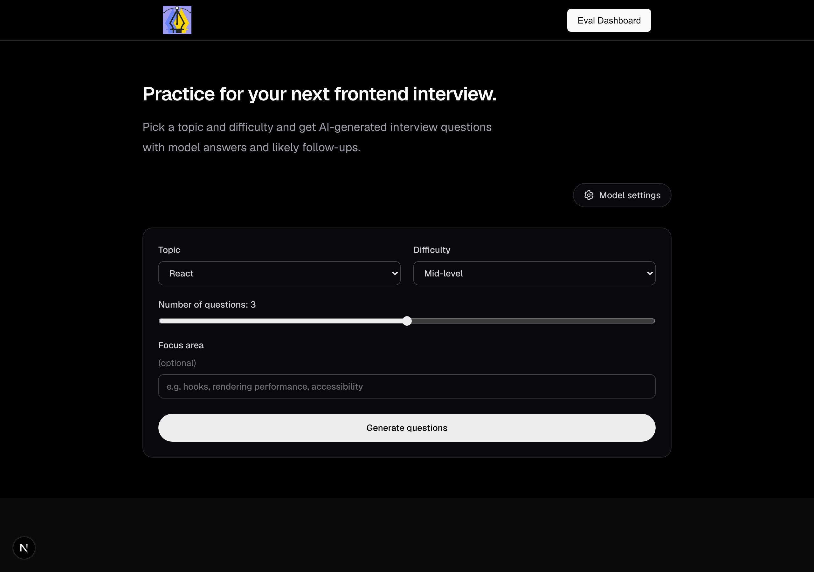
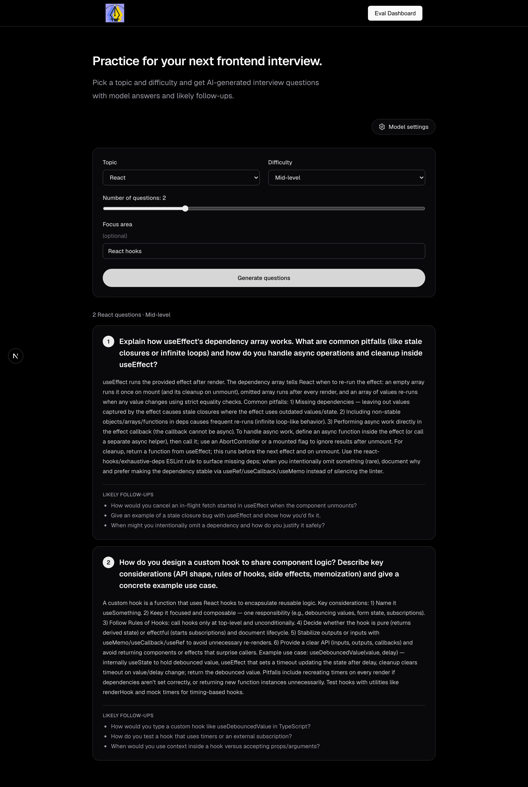
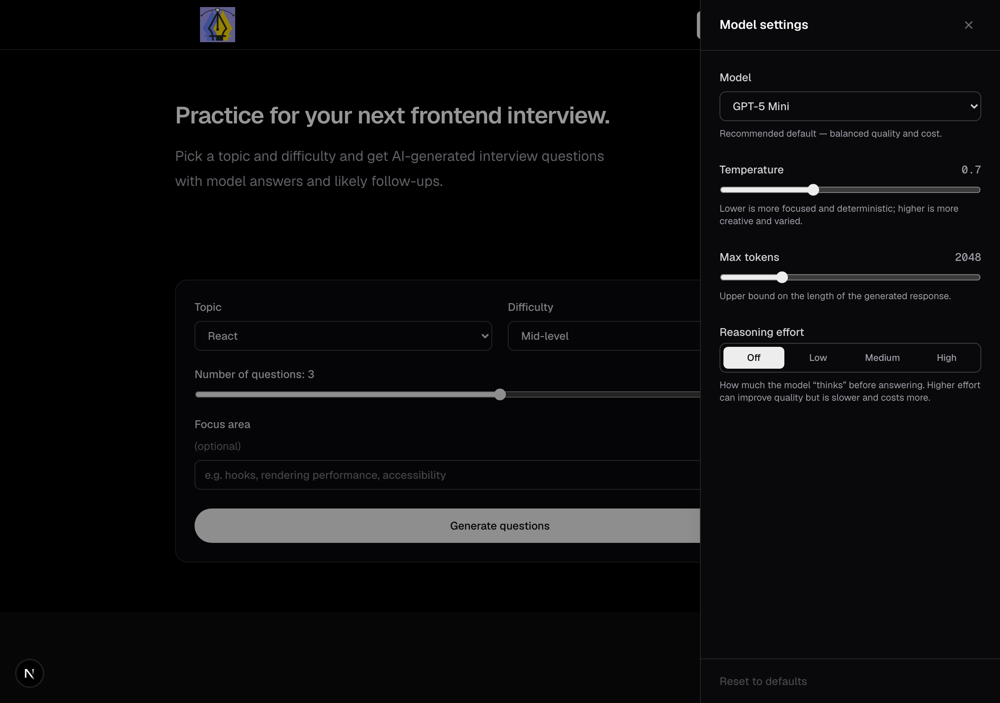
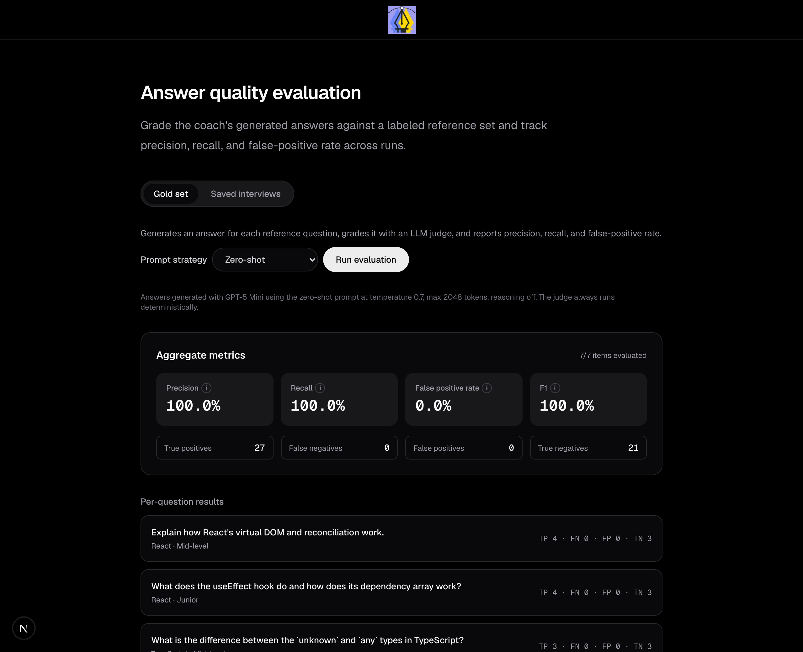

# AI Frontend Interview Coach

A [Next.js](https://nextjs.org) app that generates frontend interview questions —
with model answers and likely follow-ups — and ships with a built-in
**evaluation harness** that measures how good those AI-generated answers actually
are (precision, recall, false-positive rate) using an LLM-as-judge.

Questions and answers are generated through [OpenRouter](https://openrouter.ai);
the app defaults to the latest capable models and lets you tune model, prompt
strategy, temperature, token budget, and reasoning effort.

## Screenshots

### Home — generate an interview



### Questions, answers, and follow-ups



### Model settings — tune the generation



### Eval dashboard — measure answer quality



## Features

- **Interview generation** — pick a topic (React, Next.js, TypeScript,
  JavaScript, CSS, System Design), a difficulty (junior / mid / senior), the
  number of questions, and an optional focus area. Each question comes with a
  model answer and likely follow-ups.
- **Model settings** — choose the model and tune temperature, max tokens, and
  reasoning effort from a settings sidebar. All values are re-validated and
  clamped server-side.
- **Evaluation dashboard** (`/eval`) — treats the app's own output as the system
  under test:
  - **Gold set** — grades generated answers against a hand-labeled reference set
    and reports **precision, recall, false-positive rate, and F1**, plus a
    confusion matrix and per-question verdicts.
  - **Prompt strategies** — compare well-known prompting techniques (zero-shot,
    chain-of-thought, few-shot) on the same gold set to see which produces the
    most accurate answers.
- **Saved interviews & re-evaluation** — every generated interview is auto-saved
  to your browser (localStorage). On the eval page you can:
  - Grade the saved answers. Since saved Q&A carry no labels, the server derives
    a grading reference from the **question alone** (never the answer, which
    would leak), then judges the saved answer against it — the same
    precision/recall machinery as the gold set.
  - **Cache derived labels** back into the dataset, so a re-run skips the derive
    call (2 model calls per question → 1).
  - **Pick which interviews** to grade (per-interview selection).
  - **Compare runs over time** in a persistent, expandable run-history table
    that survives reloads.

## How evaluation works

Each reference item pairs a question with two labeled sets:

- `keyPoints` — facts a correct answer **should** contain (the positive class).
- `distractors` — plausible-but-wrong claims a good answer must **avoid** (the
  negative class).

The harness generates (or, for saved interviews, reuses) an answer, then a
deterministic LLM judge decides, for each key point, whether the answer covered
it, and for each distractor, whether the answer wrongly asserted it. That yields
one confusion matrix per item:

|                        | Positive (key points) | Negative (distractors) |
| ---------------------- | --------------------- | ---------------------- |
| **Asserted / covered** | True positive         | False positive         |
| **Absent / avoided**   | False negative        | True negative          |

from which precision, recall, false-positive rate, and F1 are micro-averaged
across items. The judge always runs at temperature 0 so grades are stable across
runs.

## Tech stack

- **Next.js 16** (App Router) + **React 19**
- **TypeScript** (strict mode)
- **Tailwind CSS v4** (CSS-configured via `@theme`, no `tailwind.config`)
- **OpenRouter** for model access

## Architecture

```
app/
  page.tsx                    Home — interview generator
  eval/page.tsx               Evaluation dashboard
  api/
    interview/route.ts        POST — generate an interview (streamed)
    answer/route.ts           POST — answer a follow-up question (streamed)
    evaluate/route.ts         POST — run the gold set
    evaluate/saved/route.ts   POST — grade saved interview answers
components/
  InterviewForm.tsx           Generation form (auto-saves results)
  EvalDashboard.tsx           Gold-set + saved-interview eval, run history
  ResultCard, SettingsSidebar, LoadingState, header
lib/
  openrouter.ts               OpenRouter transport + defensive parsing
  security.ts                 Validation, sanitization, rate limiting
  prompts/, prompts.ts        System prompts + prompt strategies
  eval/
    goldset.ts                Hand-labeled reference set
    runner.ts                 Generate → judge → confusion matrix
    autolabel.ts              Derive a reference from a question alone
    savedRunner.ts            Grade saved answers (with label caching)
    metrics.ts                Precision / recall / FPR / F1 math
  savedInterviews.ts          localStorage store for generated interviews
  savedRuns.ts                localStorage store for eval-run history
types/
  interview.ts, eval.ts       Shared client/server types
```

Notes:

- **Saved data is per-browser.** Interviews and run history live in
  `localStorage`, so they don't sync across devices and are cleared with site
  data.

## Security

Defense-in-depth around one core assumption: **every input is hostile** — the
request body, the free text, the model's output, and the browser's own storage
(`lib/security.ts` plus the API routes).

- **Secrets stay server-side.** `OPENROUTER_API_KEY` lives in `.env`
  (gitignored) and is only read in `lib/openrouter.ts`, a server-only module
  never imported into client components.
- **Strict validation on every API route.** Enums are allowlisted (topic,
  difficulty, model, reasoning effort, prompt strategy) and numbers clamped to
  bounds (temperature, max tokens, question count). Critical fields reject with
  400; tuning knobs degrade to safe defaults. The model allowlist means a forged
  request can never route an arbitrary or expensive model to the paid API.
- **Free-text sanitization.** Before any text reaches a prompt, `sanitizeText`
  strips control characters, collapses whitespace, and hard-caps length.
- **Prompt-injection defense, two layers.** A regex detector rejects jailbreak
  phrasing in the `focus` field (ignore-previous-instructions,
  reveal-system-prompt, role hijacking, fake `system:` turns) with a 400 before
  the model ever sees it; the system prompt additionally frames all user text as
  untrusted _data_ to theme questions around, never as instructions. Eval and
  follow-up text skips the regex — legitimate technical answers contain words
  like "system" — so sanitize + length cap is the guardrail there.
- **Rate limiting and cost controls.** A fixed-window in-memory limiter caps
  requests per client IP (with a `Retry-After` header); eval routes get a
  separate bucket because one run fans out many paid calls. Upstream LLM calls
  carry hard timeouts (45s generate, 120s eval) and responses are never cached
  (`force-dynamic`). The limiter is per-process by design — swap in
  Redis/Upstash for multi-instance scale.
- **Model output is untrusted.** Responses are parsed defensively — tolerant
  parsing, shape coercion, clamped to `MAX_QUESTIONS` — never assumed to match
  the requested schema.
- **Client storage is untrusted.** localStorage payloads (saved interviews,
  cached labels) can be hand-edited in devtools, so they are re-validated on
  read _and_ server-side on submit; tampered labels degrade to a fresh
  re-derive rather than a broken grade.

## Prerequisites

- [Node.js](https://nodejs.org) 20 or newer
- An [OpenRouter](https://openrouter.ai/settings/keys) API key

## Getting Started

1. **Install dependencies:**

   ```bash
   npm install
   ```

2. **Configure environment variables.** Create a `.env` file in the project root:

   ```bash
   OPENROUTER_API_KEY="sk-or-..."
   ```

   Get a key at <https://openrouter.ai/settings/keys>. Never commit `.env` — it's
   gitignored. An optional `OPENROUTER_MODEL` env var overrides the model choice
   globally.

3. **Run the development server:**

   ```bash
   npm run dev
   ```

   Open [http://localhost:3000](http://localhost:3000). Generate an interview on
   the home page, then visit **Eval Dashboard** to grade the answers.

## Commands

- `npm run dev` — Start the development server
- `npm run build` — Build for production
- `npm start` — Serve the production build (run `npm run build` first)
- `npm run lint` — Run ESLint
- `npm run typecheck` — Type-check with `tsc --noEmit`
- `npm run format` — Format with Prettier (`format:check` to verify only)
